  

  
  
  

---

### `$ whoami`

I was a police officer: shift work, reports, a lot of paperwork. In **June 2023** I started writing code two hours a day after every shift. In **July 2024** I got my first paid role, and today I ship production software end to end.

- **Now:** Software Engineer at **Atomic Solutions** (Jun 2026 →), maintaining **eight live products** across health, social, gaming and e-commerce
- **Before:** Software Developer at **Info Puls** (Jul 2024 – Jun 2026)
- **How:** Postgres schema and row-level security → Edge Functions → React, Next.js and React Native clients. No hand-off in between.
- **AI:** I learned by hand first, then used AI as a tutor, and now use it for leverage. Every line that ships is one I can defend.

### `$ ls ~/work`

<table>
  <tr>
    <td width="50%" valign="top">
      <h4><a href="https://markostupar.org/work/kapp-mobile">KApp</a></h4>
      <code>BLOOD DONATION PLATFORM</code>
      
Donor app and admin dashboard used by transfusion centres across the Republic of Srpska. Authorisation lives in Postgres RLS, not app code.

      Expo · React Native · Next.js · Supabase
    </td>
    <td width="50%" valign="top">
      <h4><a href="https://markostupar.org/work/tvoja-integracija">Tvoja Integracija</a></h4>
      <code>RELOCATION PLATFORM</code>
      
Everything needed to move to Germany: guides, cities, businesses, bookings and an e-book reader. One Turborepo serves mobile and admin.

      Expo · Next.js · Turborepo · Supabase
    </td>
  </tr>
  <tr>
    <td width="50%" valign="top">
      <h4><a href="https://markostupar.org/work/moja-apoteka">Moja Apoteka</a></h4>
      <code>PHARMACY E-COMMERCE</code>
      
A mobile storefront wired into a live WooCommerce catalogue, with a typed API layer generated by Orval, barcode scanning and checkout.

      React Native · WooCommerce · Orval
    </td>
    <td width="50%" valign="top">
      <h4><a href="https://markostupar.org/work/maza">Maza</a></h4>
      <code>SOCIAL APP FOR DOG OWNERS</code>
      
Dog profiles, meetups, dog-friendly places with maps, clicker training, messaging and deep links into shared content.

      React Native · Supabase · Google Places
    </td>
  </tr>
</table>

<table>
  <tr>
    <td width="50%" valign="top">
      <h4><a href="https://markostupar.org/work/zesty-bet">zesty.bet</a></h4>
      <code>ONLINE CASINO & BETTING</code>
      
A casino and betting platform covering the player-facing product and the systems behind it, built to stay responsive under load.

    </td>
    <td width="50%" valign="top">
      <h4><a href="https://markostupar.org/work/iwaaant">Iwaaant</a></h4>
      <code>SOCIAL NETWORK</code>
      
A full social network platform, covering the product surface and the backend behind it, built end to end.

    </td>
  </tr>
  <tr>
    <td width="50%" valign="top">
      <h4><a href="https://markostupar.org/work/ru4m">RU4M</a></h4>
      <code>NETWORKING PLATFORM</code>
      
Connects industry experts through events and introductions, with AI doing the matching work. Web and mobile.

    </td>
    <td width="50%" valign="top">
      <h4><a href="https://markostupar.org/work/ekuponi-mobile">eKuponi</a></h4>
      <code>COUPONS APP</code>
      
A mobile app for finding and redeeming e-coupons for PlayStation and PC games.

    </td>
  </tr>
</table>

Plus packages published under <a href="https://www.npmjs.com/package/@atomic-solutions/wordpress-api-client"><code>@atomic-solutions</code></a>. Most of this lives in private repos. <a href="https://markostupar.org/#work">Case studies →</a>

### `$ ls ~/clients`

<table>
  <tr>
    <td width="33%" valign="top">
      <h4><a href="https://kombiprevozdamjanovic.com">Kombi Prevoz Damjanović</a></h4>
      <code>VAN TRANSPORT & MOVING</code>
      
Moving, furniture and goods transport across Banja Luka and BiH, with a quote request form.

      Next.js · Tailwind · React Hook Form · Zod
    </td>
    <td width="33%" valign="top">
      <h4><a href="https://namjestajbalerina.com">Namještaj Balerina</a></h4>
      <code>CUSTOM FURNITURE</code>
      
Made-to-measure kitchens, wardrobes and office fit-outs, with a project gallery and consultation requests.

      Next.js · Tailwind · React Hook Form · Zod
    </td>
    <td width="33%" valign="top">
      <h4><a href="https://kamionprevozdobrijevic.com">Kamion Prevoz Dobrijević</a></h4>
      <code>CRANE TRUCK SERVICES</code>
      
Crane truck hire in Banja Luka: rubble removal, soil, gravel and sand delivery, loading and pallets.

      Next.js · TypeScript
    </td>
  </tr>
</table>

### `$ cat stack.txt`

  
   
  
   
  

Plus React Native, Expo, TanStack Query, Zod, Zustand, Radix UI, Playwright, Maestro, Turborepo and i18next.

### `$ git log --graph`

<picture>
  <source media="(prefers-color-scheme: dark)" srcset="https://raw.githubusercontent.com/markostupar98/markostupar98/output/snake-dark.svg" />
  <source media="(prefers-color-scheme: light)" srcset="https://raw.githubusercontent.com/markostupar98/markostupar98/output/snake-light.svg" />
  
</picture>

From the beat to the backlog. <a href="https://markostupar.org">markostupar.org</a>

